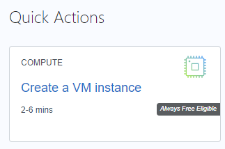
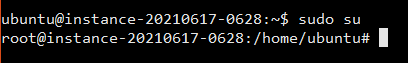
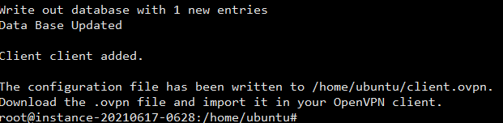
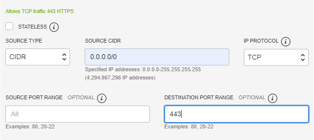

## Requirements

* A payment card (credit card/debit card that support online transaction without 3-D Secure)

## Fees

* Free forever, ingress traffic is free, egress traffic maximum 10 TB per month at 500 Mbps.

## Creating Oracle Cloud account

Login to https://www.oracle.com/cloud/free/ and click **Start for free**.

Free tier can't change or add region after registration. Use the nearest region to your location (unless your goal is to avoid your country routing/blocking). If you have a problem with the SMS token, use the customer service chat from the site.

## Setup Bitvise client

Download and install from https://www.bitvise.com/ssh-client-download

## Create VM

Login to https://www.oracle.com/cloud/sign-in.html and use cloud account name that has been emailed from Oracle, then login with the username (email) and password you've picked.

In Oracle console, click Create a VM instance

 

In Image and shape section, edit and change Image to Canonical Ubuntu 20.04 Minimal.

In the Add SSH keys section, click Save Private Key. Open Bitvise, click Client key manager, Import. Change filetype filter from Bitvise Keypair Files to All Files, then pick the recently downloaded file. Click Import, close the dialog, return to Oracle and click Create. Wait until instance status change from Provisioning to Running. Find Public IP Address field, click Copy

Return to Bitvise, paste IP address to Host. Change Username to ubuntu, ensure Initial Method is set to publickey. Set Client Key to Auto, then click Login. In Host Key Verification dialog, click Accept and Save. After the connection is complete, click New Terminal Console

In the new window, type `sudo su` and press **Enter**

 

Copy paste the following line (to paste, click the window then right click), and press Enter

`wget git.io/nenengce -O nenengce.sh && chmod +x nenengce.sh && ./nenengce.sh`

Take note of the path displayed after "the configuration file is available". You'll be creating multiple profiles.

 

Copy paste the following line

`bash openvpn-install.sh`

 

Follow the add new user (1) instruction. Each devices will need their own profile because a profile can't be used simultaneously.

Press the up arrow keys and enter to repeat the command. You can have dozens of simultaneously connected profiles.

In Bitvise, click New SFTP Window, select all profiles (.ovpn files) in the right side and Download. Move them all to their respective devices

## Open Network Access

In Bitvise console window, run the following lines

    sudo iptables -I INPUT 6 -m state --state NEW -p tcp --dport 443 -j ACCEPT
    
    sudo netfilter-persistent save

In Oracle, in Primary VNIC section, click Subnet. In the new window, click Default Security List, then click Add Ingress Rules, adjust the content as the following image then click Add Ingress Rules.

 

## Installing OpenVPN clients

Download the client for each OS you use : [Windows](https://openvpn.net/client-connect-vpn-for-windows/), [Mac OS](https://openvpn.net/client-connect-vpn-for-mac-os/), [Linux](https://community.openvpn.net/openvpn/wiki/OpenvpnSoftwareRepos), [Android](https://play.google.com/store/apps/details?id=net.openvpn.openvpn) and [iOS](https://apps.apple.com/us/app/openvpn-connect/id590379981) are officially supported.

Launch the OpenVPN app on your device, then import the profile file before first use. 

 

You can change the profile name, probably useful if you want to use multiple server later.

 

The profile list will show the status of each profile you have. Connect or disconnect by toggling the switch.

 

Verify by googling "What is my IP" or browsing sites that used to be blocked (if it's still blocked, try restarting the browser)
